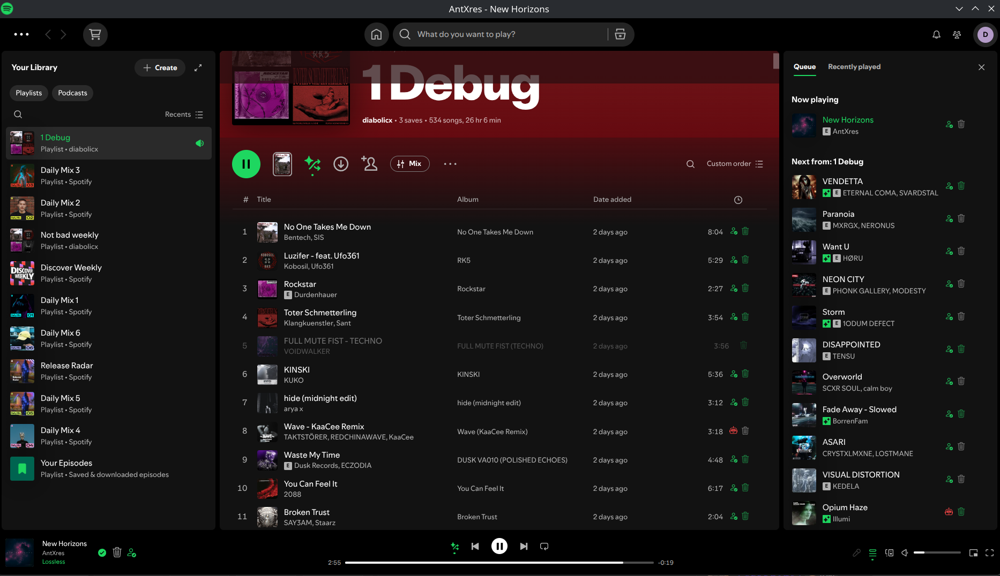
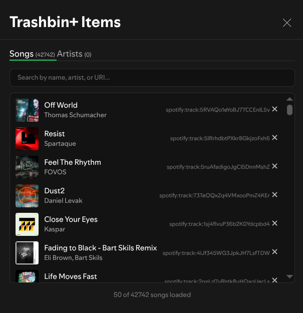
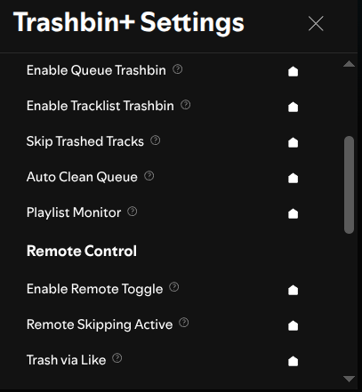

# Trashbin+

Skip songs and artists you don't like automatically! A modern upgrade to the classic Trashbin extension for Spotify.

## What it does

- **Block songs and artists** - Right-click any song or artist to add them to your trashbin
- **Auto-skip** - Trashed songs get skipped automatically when they come up
- **Easy management** - View and remove items from your trashbin anytime
- **Works everywhere** - Trash buttons appear in playlists, queue, and search results
- **Speaks your language** - Available in 70+ languages, automatically matches your Spotify language

## How to use

### Trash something you don't like

1. Right-click on any song or artist
2. Select "Place in Trashbin"
3. That's it! It will be skipped automatically from now on

### Remove from trashbin

1. Right-click on a trashed item
2. Select "Remove from Trashbin"
3. It will play normally again

### Manage your trashbin

- Click your profile picture → "Trashbin+ Items" to see everything you've trashed
- Export your list as backup or import from another device
- Clear everything at once if needed

## Settings

Access settings through your profile menu → "Trashbin+ Settings":

- **Show trash buttons** - Add quick trash buttons next to songs
- **Smart skipping** - Find next good song instead of just skipping
- **Auto-start music** - Start playing when Spotify opens

## Screenshots





## Need help?

[Report issues or ask questions here](https://github.com/0-don/trashbin-plus/issues)

<!-- ## Step 1:

```bash
git clone https://github.com/0-don/spicetify-creator.git
cd spicetify-creator
npm install
npm run build
npm link

```

## Step 2:

```bash
cd /path/to/your/trashbin-plus
npm link spicetify-creator
yarn install
yarn build
spicetify config extensions trashbin-plus.js
spicetify apply

spicetify enable-devtools
spicetify apply

## To uninstall:
spicetify config extensions trashbin-plus.js-
spicetify apply

``` -->
