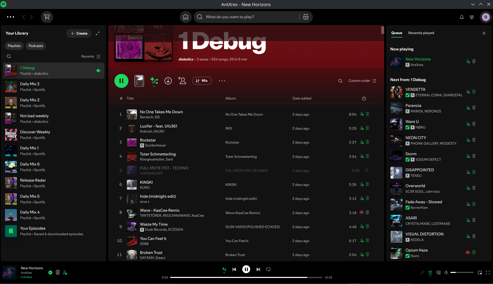
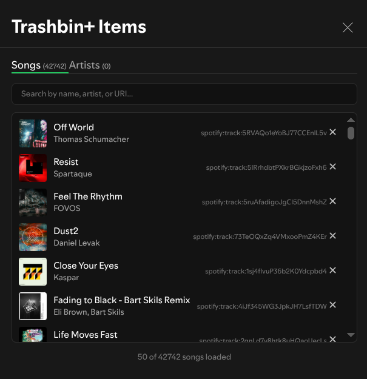

# Trashbin+

Auto-skip songs and artists you don't like. A modern Spicetify extension.

## Features

- **Auto-skip** - Trashed songs and artists are skipped automatically during playback
- **Context menu** - Right-click any song or artist to trash/untrash
- **Trash buttons** - Inline trash icons in playlists, albums, and queue
- **Playbar widget** - Quick trash button and AI probability indicator in the playback bar
- **AI detection** - Detects AI-generated songs locally via ONNX, combining a spectral fakeprint model and a CQT cepstrum CNN from [lofcz/ai-music-detector](https://github.com/lofcz/ai-music-detector) (MIT, 1.2MB, bundled). Auto-trashes songs with >=80% AI confidence
- **Remote control** - Double-tap play/pause from mobile to toggle skipping. Trash songs by liking them from your phone
- **Playlist monitor** - Auto-recovers from Spotify playback glitches
- **Auto clean queue** - Removes trashed songs from Smart Shuffle queue
- **Trashed items manager** - Browse, search, import/export your trashed songs and artists
- **70+ languages** - Automatically matches your Spotify language

## Settings

Access via profile menu > **Trashbin+ Settings**.

| Section            | Setting                        | Description                                           |
| ------------------ | ------------------------------ | ----------------------------------------------------- |
| **Options**        | Enabled                        | Master on/off toggle                                  |
|                    | Show Widget Icon               | Trash icon in playbar                                 |
| **Features**       | Autoplay on Start              | Auto-play when Spotify opens                          |
|                    | Queue Trashbin                 | Trash buttons in queue panel                          |
|                    | Tracklist Trashbin             | Trash buttons in playlists/albums                     |
|                    | Skip Trashed Tracks            | Find next allowed track instead of just skipping once |
|                    | Auto Clean Queue               | Remove trashed from Smart Shuffle                     |
|                    | Playlist Monitor               | Auto-recover from playback glitches                   |
| **Remote Control** | Remote Toggle                  | Double-tap play/pause from mobile to toggle           |
|                    | Remote Skipping                | Allow trash-skipping from other devices               |
|                    | Trash via Like                 | Like a song from mobile to trash it                   |
| **AI Detection**   | AI Song Detection              | Detect AI songs on device (models bundled)            |
|                    | Trash AI Songs                 | Auto-trash songs with >=80% AI probability            |
| **Storage**        | Copy / Export / Import / Clear | Backup and manage trashbin data                       |
|                    | Clear AI Storage               | Remove cached AI classification results               |

## Hotkeys

Trashbin+ can be controlled from outside Spotify, for example from a global hotkey. Spotify has to run with remote debugging on port 9225:

```
--remote-debugging-port=9225 --remote-allow-origins=*
```

On Linux with `spotify-launcher`, put them in `~/.config/spotify-launcher.conf` as `extra_arguments = ["--remote-debugging-port=9225", "--remote-allow-origins=*"]`. Elsewhere, add them to the command or shortcut that starts Spotify.

Then run [`scripts/trashbin.sh`](scripts/trashbin.sh) (Linux, macOS, needs `bash`) or [`scripts/trashbin.ps1`](scripts/trashbin.ps1) (Windows) with a command:

| Command           | Action                                  |
| ----------------- | --------------------------------------- |
| `trash-song`      | Trash or untrash the current song       |
| `trash-artist`    | Trash or untrash the current artist     |
| `toggle-trashbin` | Turn Trashbin+ on or off                |
| `next`            | Next song                               |
| `previous`        | Previous song                           |
| `play-pause`      | Play or pause                           |
| `like-song`       | Like or unlike the current song         |
| `volume-up`       | Volume up by 10%                        |
| `volume-down`     | Volume down by 10%                      |

`-e '<javascript>'` runs any JavaScript inside Spotify instead. Without arguments the scripts run `trash-song`, so they can be pasted as is into a hotkey tool such as [Clippy](https://github.com/0-don/clippy) commands (interpreter `bash` or `powershell`); change the default in the script for another action.

## Screenshots





## Need help?

[Report issues or ask questions](https://github.com/0-don/trashbin-plus/issues)

<!--
Go to: https://www.jsdelivr.com/tools/purge
Enter: https://cdn.jsdelivr.net/gh/0-don/trashbin-plus@main/dist/trashbin-plus.js
Click purge
-->

<!-- ```bash
spicetify enable-devtools && spicetify apply

## To install:
spicetify config extensions trashbin-plus.js && spicetify apply

## To uninstall:
spicetify config extensions trashbin-plus.js- && spicetify apply

## Remote debugging (CDP) on port 9225
## Brave uses 9223, Chrome 9224, so Spotify gets 9225.
##
## The flag must go in the spotify-launcher config, NOT spicetify's
## spotify_launch_flags: this install is Arch spotify-launcher, which spawns
## the real binary itself and only forwards args listed in extra_arguments.
## `spotify-launcher -- --flag` is rejected as an unexpected argument.
##
## ~/.config/spotify-launcher.conf
## [spotify]
## extra_arguments = ["--skip-update", "--remote-debugging-port=9225", "--remote-allow-origins=*"]
##
## --remote-allow-origins=* is required since Chromium 111, otherwise the
## WebSocket upgrade is closed right after the target list loads.

## Relaunch, then verify (port needs ~10s after start to accept connections):
pkill -x spotify; setsid spotify-launcher >/dev/null 2>&1 &
curl -s http://127.0.0.1:9225/json/version
curl -s http://127.0.0.1:9225/json    # xpui page target lives here

## Spotify auto-updates wipe the spicetify patch, leaving vanilla xpui and an
## undefined Spicetify global over CDP. Re-apply after any version bump:
spicetify backup apply

``` -->
